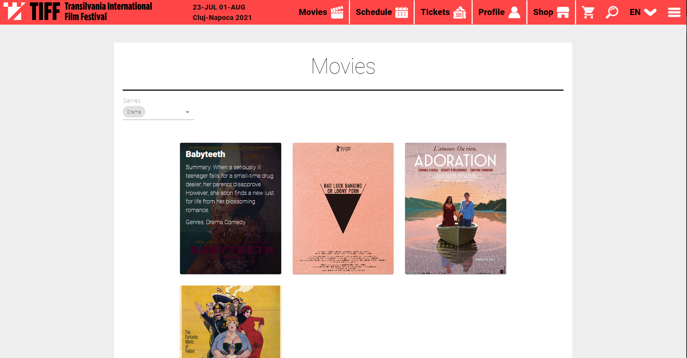
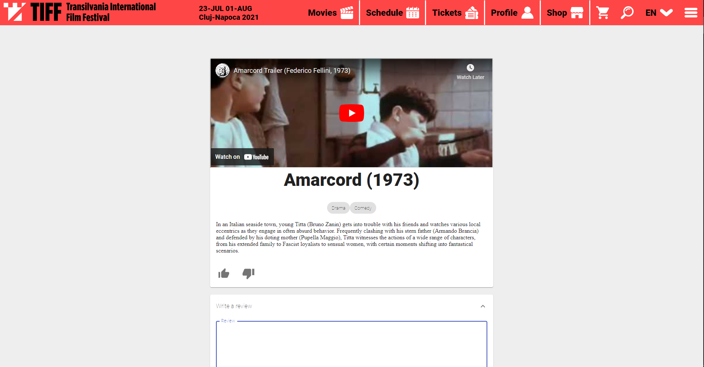
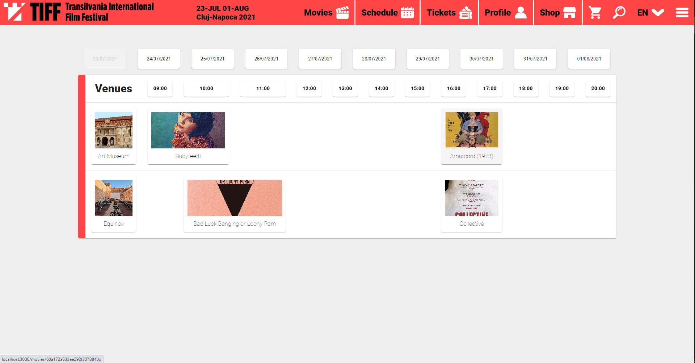
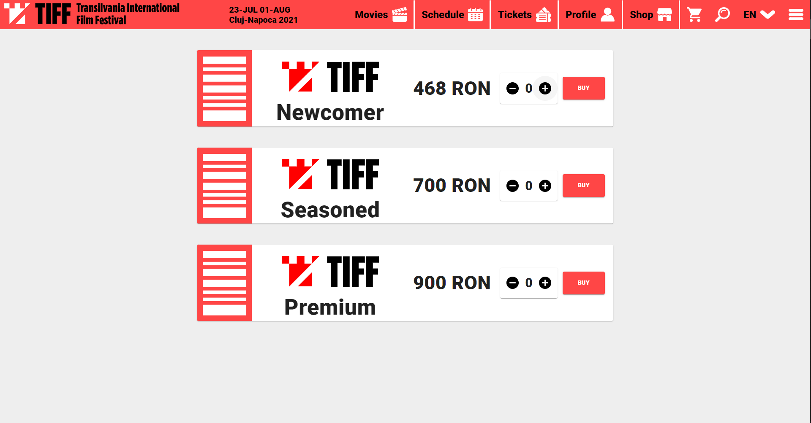
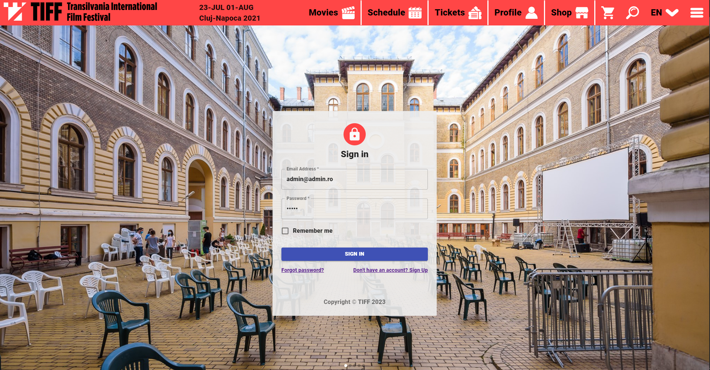
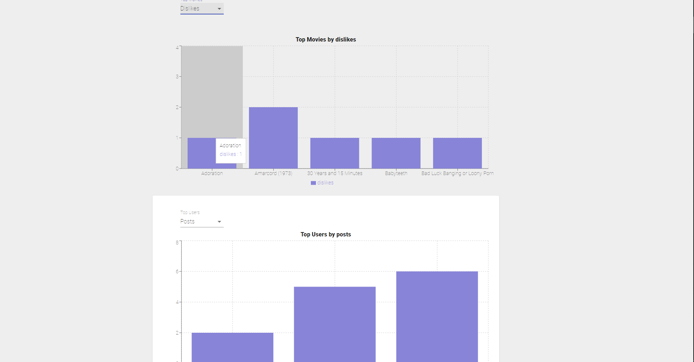
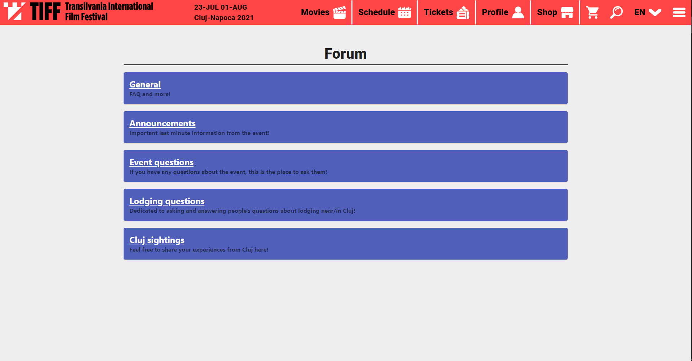
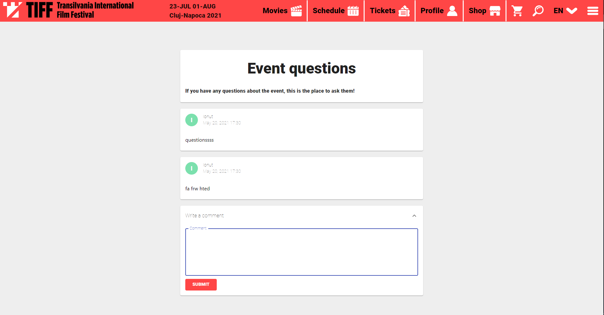

# Movie-Festival-Website
4th year faculty project involving React, MongoDB, node.js, JSON Web Tokens, password encryption and many more!

## Requirements
- MongoDB
- Node.js

To launch the site you'll have to:
1. Open Movie-Festival-Website\tiff-server\runMongo.cmd to launch the database;
2. In a command shell go to Movie-Festival-Website\tiff-server and run ***npm run serve***;
3. In a command shell go to Movie-Festival-Website\tiff and run ***npm start***;

The site should open automatically (note that it may take up to a minute until it loads). 

If the site doesn't open, use a browser to access http://localhost:3000/ .

## Functionalities

### List of movies that can be filtered by genre

### Movie page with option to add review

### Movie schedule with option to add new venues, movies and screenings (for admins)

### Tickets page (no implementation for payment)

### Profile page (will send you to an authentication page in case you aren't logged in)

You can login using: 

**Username: admin@admin.ro** 

**Password: admin**

### Statistics page only for admins

### From the menu you can access the forum which is fully functional

